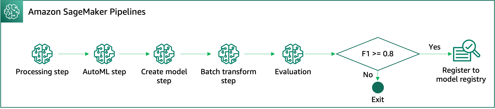
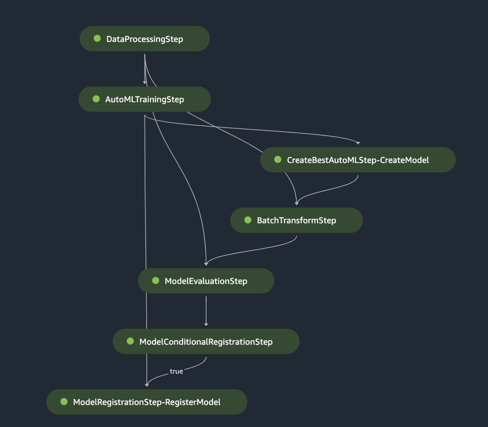

# AutoML step

This solution covers on how to integrate data processing step, AutoML step, model creation step, batch transform step, and conditionally register the best model onto SageMaker model register if the F1 score is exceed 0.8. Refer to the workflow image below.

This solution can be considered to be **Initial stage** of your MLOps journey. Moreover, you can build other processes (i.e., model deployment and model monitor steps) on top of this existing pipeline.

Once, you run the provided notebook, you will can view the DAG pipeline on the SageMaker Studio console.

